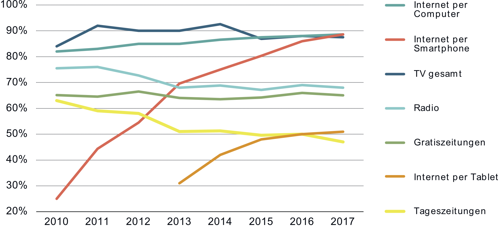

import { Head } from 'mdx-deck'

export { default as theme } from './theme'

<Head>
  <title>Chatbots</title>
</Head>

# Chatbots

---

# Philip Schönholzer

- Wohne in Luzern
- Kommunikation und Informatik
- Interaction Design
- Mitgründer der Apptiva AG und Botfabrik
- Viel unterwegs

---

## Beispiele von Chatbots

- [Geschenkidee.ch](https://www.geschenkidee.ch)
- [Postfinance](https://www.postfinance.ch/de/privat/support/chat.html)
- [Sanagate](https://www.sanagate.ch/de/home/ihre_vorteile/chatbot.html)
- [Selma](https://www.selma.io/de)
- [Coinbase](https://www.coinbase.com)
- [Vorwerk Geschäftsbereicht](https://geschaeftsberichte.vorwerk.de/2017/fuehlen/)

```notes
- Wer kennt noch weitere Beispiele?
- Schaut euch diese 15min an, um einen Eindruck der heutigen Chatbots zu erhalten
```

---

## Was ist ein Bot?

---

## Was ist ein Bot?

- Ein Programm, dass eine Aufgabe selbständig ausführt
- Ist lernfähig
- Ist intelligent (?)
- Findet eine Konversation statt, so wird von Chatbots gesprochen

---

## Warum Chatbots einsetzen?



<small>Quelle: http://media-use-index.ch/assets/files/MUI2017.pdf</small>

```notes
- Smartphone ist das meistgenutzte Medium
- Messaging ist die wichtigste App auf dem Smartphone
- Chatbots sind dort wo die Nutzer sind
```

---

import { Appear } from 'mdx-deck'
import { TitleSplit } from './layouts'

export default TitleSplit

## Eigenschaften und Bewertungskriterien

- kleiner / grosser Umfang
- eine Sprache / viele Sprachen
- ...

* Zielerreichung
* Einfachheit
* ...

```notes
Eigenschaften
- Bot führt / Besucher führt
- Freitext / Fixe Antworten
- FAQ / Assistent
- einem / mehrere Kanäle
- Gibt sich als Mensch / Bot aus
- Nur Text / Bilder, Ton, Video

Bewertungskriterien
* Absichten korrekt verstanden
* Funktionen sind klar
* Fallback
* Chatbot Challenge

- Kategorisiert und Bewertet den Chatbot (Zweiergruppe)
- 3min vorstellen
```

---

## Kurze Vorstellung des Chatbots

- Kategorisiert nach Eigenschaften
- Bewertet nach Kriterien

(3min je Gruppe)

```notes

```

---

## Einsatzmöglichkeiten von Chatbots

---

## Einsatzmöglichkeiten von Chatbots

- E-Commerce
- Kundendienst
- Marketing
- Produktivität

---

## Kanäle von Chatbots

- Web
- Facebook Messenger
- Skype
- Skype for Business
- Slack
- Telegram
- (Whatsapp)
- Weitere exotische Messenger-Dienste

```notes
- Auf was für Kanälen können Chatbots kommunizieren?
```

---

## Vorteile von Chatbots gegenüber anderen Kanälen

<ul>
  <Appear>
    <li>Bots sind super einfach zu bedienen</li>
    <li>Können das Gespräch aktiv wieder aufnehmen</li>
    <li>Geben nicht bloss Antwort, sondern führen Aktionen aus</li>
    <li>Die persönlichste Form der Interaktion mit einer Maschine</li>
    <li>Bots haben Persönlichkeit</li>
    <li>Möglichkeit zu lernen was die Besucher wollen</li>
    <li>Entwicklungsaufwand hält sich in Grenzen</li>
  </Appear>
</ul>

```notes
- Was sind die Vorteile von Chatbots gegenüber anderen Kanälen?
```

---

## Funktionsweise von Chatbots

- Freitext: NLP/NLU (Natural language processing/understanding)
- Konversation
- Aktionen ausführen
- Gespräch wieder aufnehmen

---

## NLP/NLU

- NLP basiert auf Absichten und Entitäten (Intents und Entities)
- Freitext -> Absicht zuweisen (z.B. "Will ne Pizza" -> Absicht: Pizza bestellen)
- Freitext -> Entitäten im Text extrahieren (z.B. "Will ne Proscuto" -> "Will ne {Entität: Pizza Prosciutto}")

---

## NLP/NLU-Tools

- Dialogflow (Google)
- Watson (IBM)
- LUIS (Microsoft)
- Wit.ai (Facebook)
- Lex (Amazon)
- Rasa (Open Source)

---

## Bau einen Chatbot

[www.dialogflow.com](www.dialogflow.com) (Ihr benötigt einen Google Account)

- Definiert das Ziel eures Chatbots bevor ihr mit dem Bauen beginnt
- Verwende min. eine Absicht mit einer Entität
- Baut den Chatbot (30min)
- Andere Gruppe kategorisiert und bewertet (10min) euren Chatbot und stellt diesen vor (3min)

---

## Vorstellen

(3min je Gruppe)

---

## Fragen?
